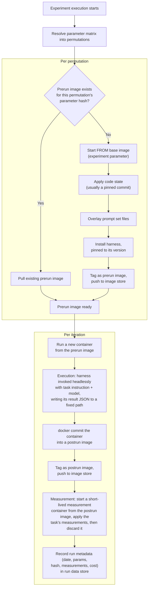

# Docker Execution

The Docker run mechanics and resulting artifacts. See
[081-docker-tagging.md](081-docker-tagging.md) for how the resulting prerun/postrun
images are named, and [030-terminology.md](030-terminology.md#container-run-lifecycle) for
the **prerun image** / **postrun image** / **container run** definitions this process
implements.

## Process

The per-permutation steps are the fold over each parameter's `applyParameter` fragment,
in the order shown. _(Referenced by:
[060-experiment-parameters.md](060-experiment-parameters.md#declarations-and-applyparameter).)_

What gets written to the run data store at `P`, and what's deliberately *not* extracted
in v1 (the OTel trace and session transcript — pull the postrun image for those instead),
is covered in [085-experiment-results.md](085-experiment-results.md).

## Why commit happens before measurement

Measurement runs at `O`, *after* the postrun image has been committed and pushed — not
against the still-running execution container. _(Referenced by:
[030-terminology.md](030-terminology.md#container-run),
[085-experiment-results.md](085-experiment-results.md),
[087-collecting-token-costs.md](087-collecting-token-costs.md).)_

- **The postrun image stays exactly the agent's end state.** Measuring in a separate,
  discarded container keeps rendered test files, freshly installed dependencies, and test
  output out of the preserved artifact.
- **First-pass measurement and backfill become the same path.** Applying a new
  measurement to a year-old run is the same operation as measuring a fresh one: start a
  measurement container from the postrun image and run the instrument against it. See
  [085-experiment-results.md](085-experiment-results.md).
- **The artifact is durable before anything can go wrong.** If measurement crashes, the
  image is already pushed, so the run isn't lost — the measurements can simply be applied
  again later.

The harness writes its own result JSON (usage, cost, session ID) to a fixed path inside
the container at `L`, before the commit at `M`, so those numbers are preserved *in* the
postrun image rather than only captured on stdout. A measurement container can therefore
read them years later, exactly as the original run did.

## Open questions

- **Thunderjar's own injected setup.** Beyond the six experiment parameters, Thunderjar
  itself may need to bake things into the image that aren't any experimenter's concern —
  e.g. OTel collector config or other instrumentation needed for telemetry. Where this
  fits in the Initial Setup sequence (part of the base image? its own step? applied to
  every prerun image regardless of permutation?) is unresolved. Revisit. (Also noted in
  [020-goals-non-goals.md](020-goals-non-goals.md#to-revisit).)
