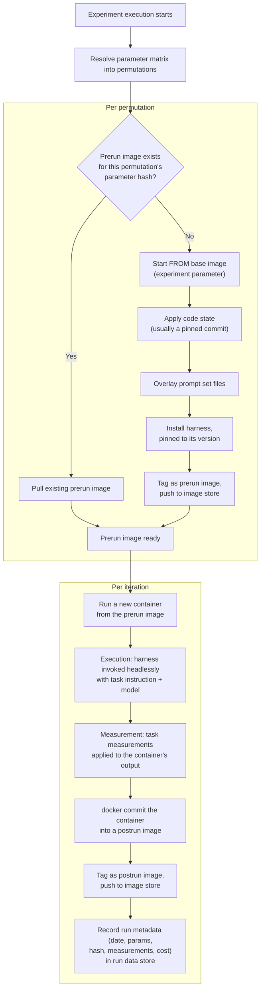

# Docker Execution

The Docker run mechanics and resulting artifacts. See
[081-docker-tagging.md](081-docker-tagging.md) for how the resulting prerun/postrun
images are named, and [030-terminology.md](030-terminology.md#container-run-lifecycle) for
the **prerun image** / **postrun image** / **container run** definitions this process
implements.

## Process

What gets written to the run data store at `P`, and what's deliberately *not* extracted
in v1 (the OTel trace and session transcript — pull the postrun image for those instead),
is covered in [085-experiment-results.md](085-experiment-results.md).

## Open questions

- **Thunderjar's own injected setup.** Beyond the six experiment parameters, Thunderjar
  itself may need to bake things into the image that aren't any experimenter's concern —
  e.g. OTel collector config or other instrumentation needed for telemetry. Where this
  fits in the Initial Setup sequence (part of the base image? its own step? applied to
  every prerun image regardless of permutation?) is unresolved. Revisit. (Also noted in
  [020-goals-non-goals.md](020-goals-non-goals.md#to-revisit).)
